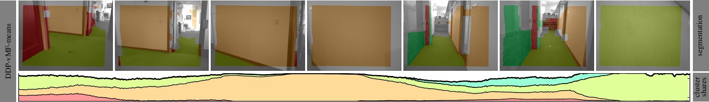
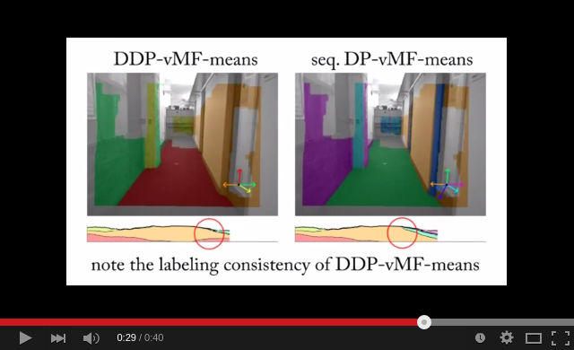

### Bayesian Nonparametric Small-Variance Asymptotic Clustering Algorithms




This is a library of Bayesian nonparametric small-variance asymptotic
clustering algorithms: DP-means, Dynamic means, DP-vMF-means,
DDP-vMF-means.
For comparison reasons the library also implements k-means as well as
spherical k-means.

This library comes with an executable that allows batch clustering
using DP-vMF-means, DP-means, spherical k-means and k-means.

For an example of using DDP-vMF-means refer to
[rtDDPvMF](https://github.com/jstraub/rtDDPvMF),
which relies on this package's dpMMlowVar library to perform real-time
directional segmentation from Kinect RGB-D streams using DDP-vMF-means. 
[](http://www.youtube.com/watch?v=wLP18q80oAE)


If you use DP-vMF-means or DDP-vMF-means please cite:
```
Julian Straub, Trevor Campbell, Jonathan P. How, John W. Fisher III. 
"Small-Variance Nonparametric Clustering on the Hypersphere", In CVPR,
2015.
```
If you use Dynamic-means please cite:
```
T. Campbell, M. Liu, B. Kulis, J. How, and L. Carin. "Dynamic
Clustering via Asymptotics of the Dependent Dirichlet Process Mixture".
In Advances in Neural Information Processing Systems (NIPS), 2013.
```

### Dependencies
This code is dependent on Eigen3, Boost, CUDA, OpenCV, OpenMP and PCL.
It has been tested on Ubuntu 14.04 with 
- Eigen3 (3.0.5) 
- Boost (1.54)
- CUDA (6.5)
- OpenCV (2.4)
- PCL (1.7)

### Install

This package uses [the pods build
system](http://sourceforge.net/p/pods/home/Home/). Used widely at CSAIL
MIT the build system makes it easy to break up software projects into
small packages that can be checked out and compiled automatically (see
below).

- *Linux:* 

    Install Eigen3, Boost, OpenCV, and PCL

    ```
    sudo apt-get install libeigen3-dev libboost-dev libopencv-dev libpcl-1.7-all-dev
    ```

    Install the appropriate CUDA version matching with your nvidia
    drivers. On our machines we use `nvidia-340-dev` with
    `libcuda1-340 cuda-6-5 cuda-toolkit-6-5`

    Clone this repository and compile the code:

    ```
    git clone git@github.com:jstraub/dpMMlowVar; cd dpMMlowVar;
    make checkout; make configure; make -j6; make install;
    ```
    
    Note that this will checkout several other necessary repositories.
    To update all repositories run
    
    ```
    make update; make configure; make -j6; make install;
    ```

### Getting Started

After you have compiled the code you can run clustering of the surface
normals of an example data set in the ./data/ folder by running:
```
cd ./python; python dpView.py
```
Note that the extraction of surface normals necessitates matlab. An
alternative is to directly run segmentation from Kinect RGB-D frames
using the 
[rtDDPvMF](https://github.com/jstraub/rtDDPvMF) package.

### Usage
```
./dpMMlowVarCluster -h
Allowed options:
  -h [ --help ]         produce help message
  --seed arg            seed for random number generator
  -N [ --N ] arg        number of input datapoints
  -D [ --D ] arg        number of dimensions of the data
  -T [ --T ] arg        iterations
  -a [ --alpha ] arg    alpha parameter of the DP (if single value assumes all 
                        alpha_i are the same
  -K [ --K ] arg        number of initial clusters 
  --base arg            which base measure to use (only spkm, kmeans, 
                        DPvMFmeans right now)
  -p [ --params ] arg   parameters of the base measure
  -i [ --input ] arg    path to input dataset .csv file (rows: dimensions; 
                        cols: different datapoints)
  -o [ --output ] arg   path to output labels .csv file (rows: time; cols: 
                        different datapoints)
  --mlInds              output ml indices
  --centroids           output centroids of clusters
  --silhouette          output average silhouette
  --shuffle             shuffle the data before processing
```

### Contributors
Julian Straub and Trevor D. Campbell
